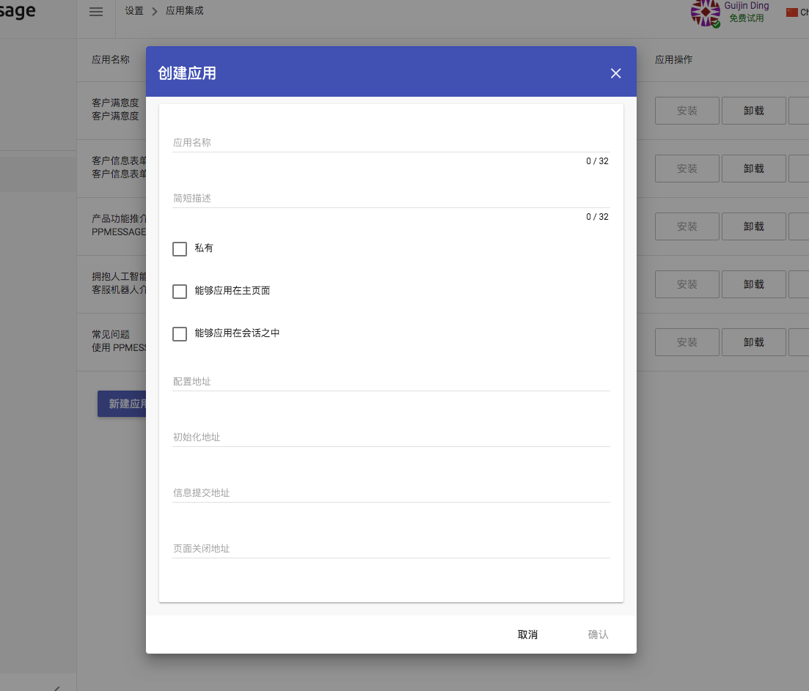

PPMESSAGE 是一个真正的消息平台，支持第三方应用集成。应用集成的界面主要体现在主页和消息内应用上。

每个应用都对应访客界面的一个消息卡片，消息卡片可以展示在主页之中，也可以展示在消息会话界面之中。

通过应用集成，访客可以不离开消息界面就能完成企业应用交互。

通过设置·应用集成可以创建管理应用。

## 新建应用

每个应用可以选择是否私有，如果不是私有，那么整个这个应用将对整个 PPMESSAGE 系统有效，如果私有，只能您自己的团队使用。

应用范围可以选择 主页和会话，是指这个应用将在什么范围内使用，如果是主页，那么安装了应用后，您的访客界面的主页将展示这个应用的界面。同样，如果选择了会话，那么这个应用可以在会话过程中使用，一般是座席服务人员发送给访客，让访客使用这个应用消息，在消息上直接进行交互。

配置地址是指这个应用的一些前置配置交互，这个地址是您提供的URL，PPMESSAGE通过访问这个URL，获取开发者为这个应用提供的配置信息。这是可选的，一般不需要提供。

初始化地址是指这个应用在安装时候提供的交互信息，当安装应用的时候，会访问应用的初始化地址，这个地址（URL）会返回一个关于这个应用的界面的描述，实际上是一个按照 PPMESSAGE 开发应用的要求提供的 JSON，这个 JSON 描述了这个应用展示的初始界面。这个地址是必须的。

提交地址是这个应用在进行提交的时候使用的交互地址，当访客与应用交互的时候，访客可能填写了应用的表单或者点击了应用的按钮，这时候就需要提交地址，这个地址会根据请求的参数返回一个新的界面的 JSON，这个 JSON 描述了应用的进一步的交互界面。这个地址是可选的。对于打开网页这类的操作是不需要提交地址的。

页面关闭地址是指在消息窗口内打开网页，客户关闭这个网页所触发的地址，这个地址是可选的。

## 安装、卸载、删除应用

只能删除自己创作的应用，如果这个应用已经公开，还是要谨慎删除，因为可能很多客户已经在使用中。

安装过程有可能失败，因为安装要检查初始化地址，获取应用的初始界面的信息。

