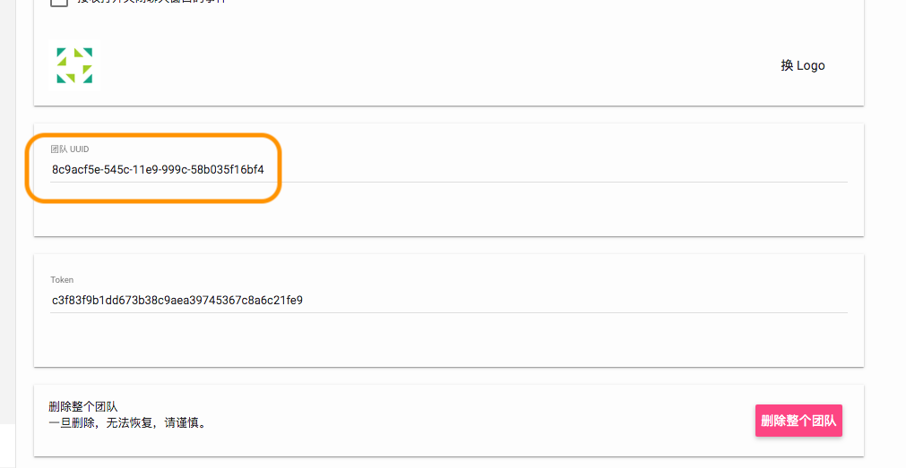
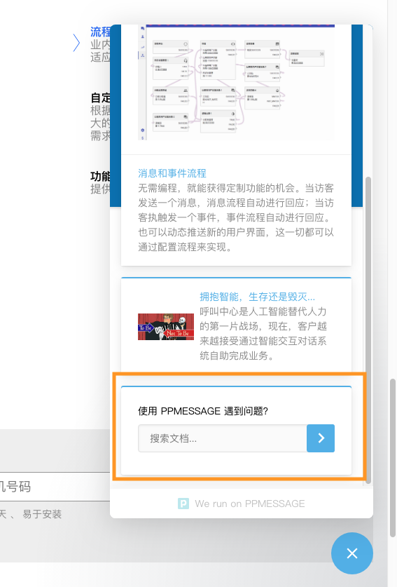
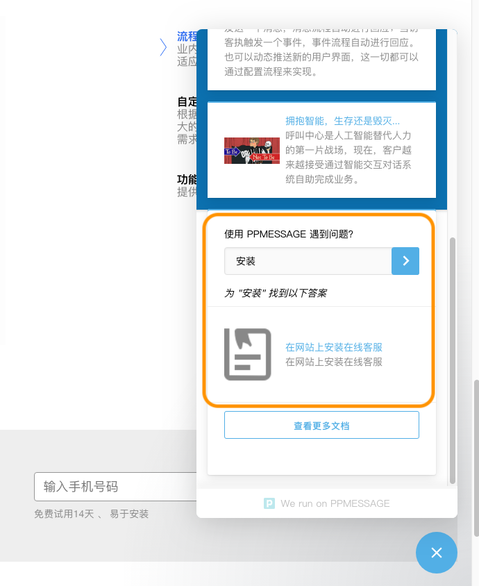

PPMESSAGE 是一个真正的消息平台，支持第三方应用集成。应用集成的界面主要体现在主页和消息内应用上。

每个应用都对应访客界面的一个消息卡片，消息卡片可以展示在主页之中，也可以展示在消息会话界面之中。

通过应用集成，访客可以不离开消息界面就能完成企业应用交互。

> 前提，应用开发者需要拥有自己的 Web 服务器。如果访问 PPMESSAGE 内数据请在团队设置界面中找到团队的 UUID （APP UUID）和 TOKEN。




开发应用之前要创建应用，同时指定各种地址，最不可缺少的就是初始化地址。

当这个应用被安装的时候，PPMESSAGE 系统会向应用初始化地址发送一个 POST 请求，这个请求会包含访客的信息和应用的设置信息。希望初始化地址返回一个形如如下的 JSON。

```json
   {
        "applet_uuid": None,
        "canvas": {
            "content":{
                "components":[
                    {
                        "type":"input",
                        "id":"q",
                        "label":"使用 PPMESSAGE 遇到问题？",
                        "placeholder":"搜索文档...",
                        "disabled":False,
                        "save_state":"unsaved",
                        "action":{"type":"submit","aria_label":"Submit search"},
                        "aria_label":"Search"
                    }
                ]
            },
            "stored_data":{}
        }
    }
```

这个信息在 PPMESSAGE 的访客页面中展示的效果：





当访客提交内容搜索后，这个提交的请求发送给提交地址。POST 数据的内容和返回的内容基本一致，在 component 中多了一个 value，表示这个 component 输入的值，这样卡片提交地址就能够根据 components 里面的 value 决定如何返回进一步的信息。


如访客提交和 ‘安装’，那么发送给卡片提交地址的内容为：

```json
{
        "canvas": {
            "content":{
                "components":[
                    {
                        "type":"input",
                        "id":"q",
                        "label":"使用 PPMESSAGE 遇到问题？",
                        "placeholder":"搜索文档...",
                        "disabled":False,
                        "save_state":"unsaved",
                       "value": "安装", 
                       "action":{"type":"submit","aria_label":"Submit search"},
                        "aria_label":"Search"
                    }
                ]
            },
            "stored_data":{}
        }
    }
}
```

卡片提交地址返回为：

```json
{
"canvas": {
        "content": {
          "components": [
            {
              "type": "input",
              "value": "",
              "label": "\u4f7f\u7528 PPMESSAGE \u9047\u5230\u95ee\u9898\uff1f",
              "disabled": false,
              "save_state": "unsaved",
              "action": {
                "type": "submit",
                "aria_label": "Submit search"
              },
              "placeholder": "\u641c\u7d22\u7b54\u6848...",
              "id": "q",
              "aria_label": "Search"
            },
            {
              "type": "spacer",
              "id": "ab0e791c-5683-11e9-a2ae-00163e0c79f6",
              "size": "s"
            },
            {
              "text": "*\u4e3a \"\u5b89\u88c5\" \u627e\u5230\u4ee5\u4e0b\u7b54\u6848*",
              "style": "paragraph",
              "type": "text",
              "id": "ab0e7c50-5683-11e9-a2ae-00163e0c79f6",
              "align": "left"
            },
            {
              "disabled": false,
              "items": [
                {
                  "rounded_image": false,
                  "disabled": false,
                  "image_height": 42,
                  "subtitle": "\u5728\u7f51\u7ad9\u4e0a\u5b89\u88c5\u5728\u7ebf\u5ba2\u670d",
                  "title": "\u5728\u7f51\u7ad9\u4e0a\u5b89\u88c5\u5728\u7ebf\u5ba2\u670d",
                  "action": {
                    "url": "https://ppmessage.cn/docs/installation-on-website.html?sheet=true",
                    "type": "sheet"
                  },
                  "image": "https://source.unsplash.com/random",
                  "type": "item",
                  "id": "ab0e81a0-5683-11e9-a2ae-00163e0c79f6",
                  "image_width": 32
                }
              ],
              "type": "list",
              "id": "ab0e7f2a-5683-11e9-a2ae-00163e0c79f6"
            },
            {
              "type": "spacer",
              "id": "ab0e84a2-5683-11e9-a2ae-00163e0c79f6",
              "size": "xs"
            },
            {
              "style": "secondary",
              "label": "\u67e5\u770b\u66f4\u591a\u6587\u6863",
              "disabled": false,
              "action": {
                "url": "https://ppmessage.cn/docs/",
                "type": "url"
              },
              "type": "button",
              "id": "more-results"
            }
          ]
        }
      }
    }
```

展示在前端的效果：



这里面的字符串都用 UNICODE 表示了，无法直接阅读，知道不是乱码就可以了。

值得注意的是每个卡片由多个界面组件组成，每个组件必须有一个唯一的 id。