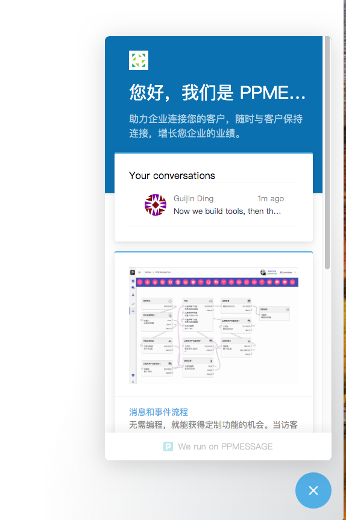
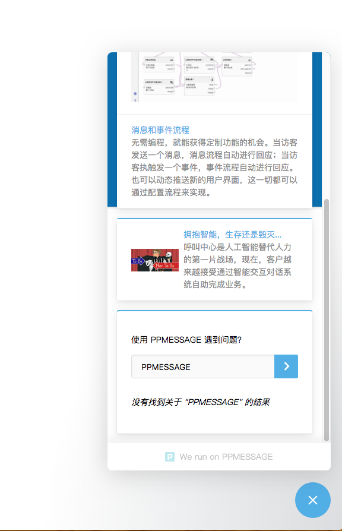
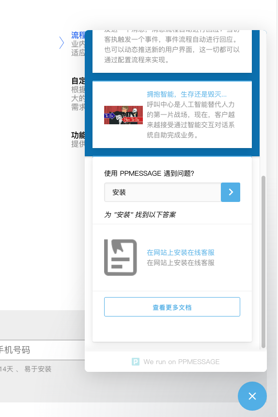
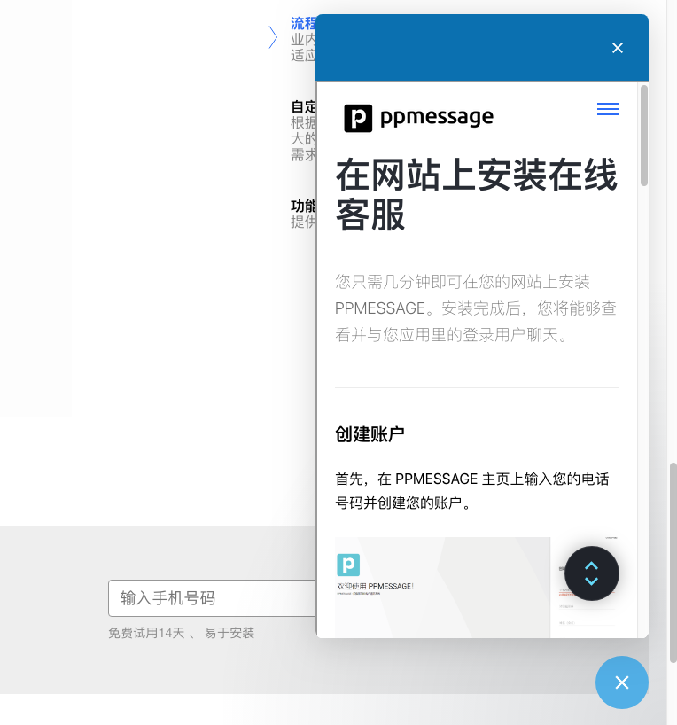

PPMESSAGE 是一个真正的消息平台，支持第三方应用集成。应用集成的界面主要体现在主页和消息内应用上。

每个应用都对应访客界面的一个消息卡片，消息卡片可以展示在主页之中，也可以展示在消息会话界面之中。

通过应用集成，访客可以不离开消息界面就能完成企业应用交互。

下图主页应用集成产生的消息卡：

通过在主页上集成应用，展示企业想要重点推介给访客的信息。访客可以进一步和应用交互，一般会是打开一个新的浏览器窗口访问详细内容，或者直接在消息界面中展示详细内容。

PPMESSAGE 的主页应用集成功能只限于付费用户，免费用户的主页将显示 PPMESSAGE 的产品信息和帮助功能。

搜索 PPMESSAGE 的使用帮助可以非常快捷的查找 PPMESSAGE 的产品文档，而无需离开当前的网页和消息界面。

在消息界面内浏览，不用离开消息界面。

免费试用可以开发应用，但不能够改变主页上的显示内容。

