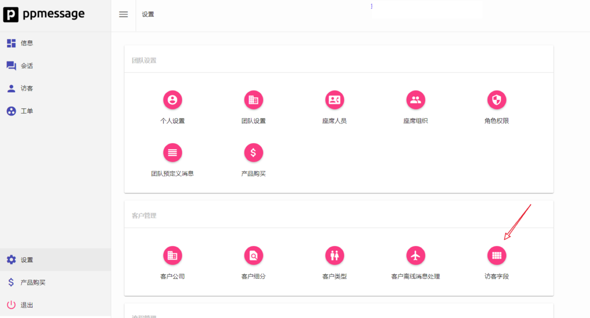
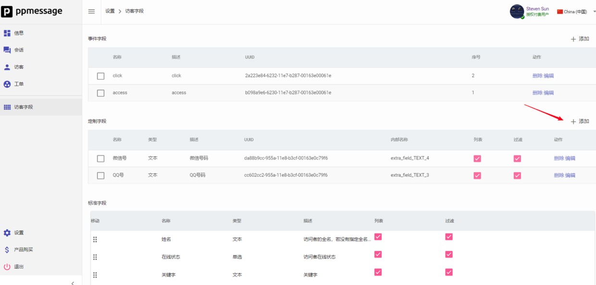
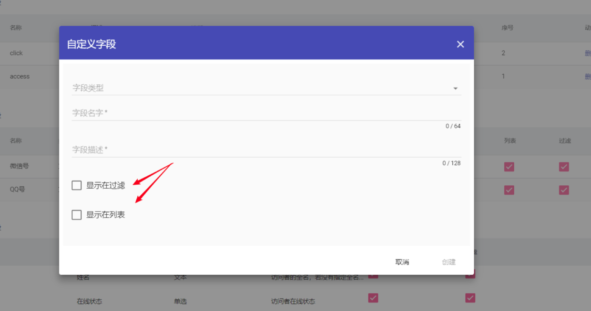
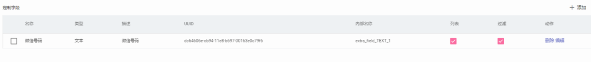
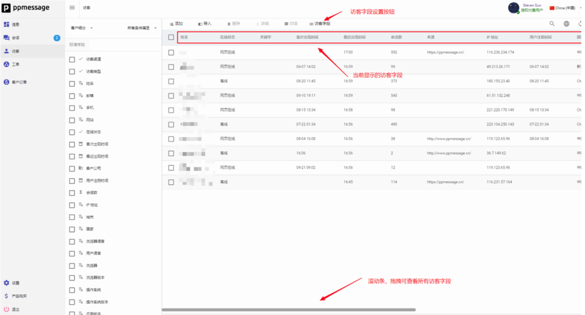
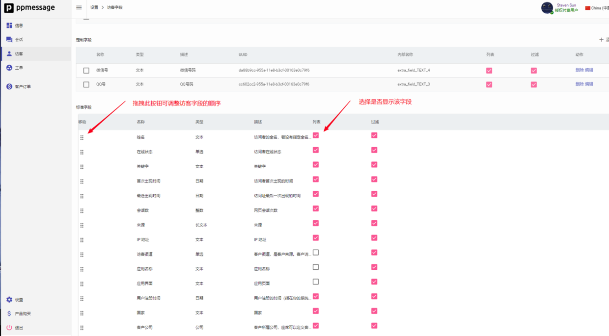

PPMESSAGE 允许您根据您的业务创建和跟踪有关客户的定制字段。您可以使用此数据过滤和创建客户细分，为该细分里的客户分配不同的座席，发送有针对性的消息和进行营销活动。

定制字段跟踪有关您的客户的基本信息，例如某人所在的产品计划，或者他们注册的时间，而不是追踪客户的行为。

下面是一个示例：如果您的产品是项目管理工具，您可以跟踪每个用户拥有的文件数量。 如果您想要向尚未开始向该工具添加文件的用户发送消息，则可以设置针对“文件小于1”的用户发送消息。

在PPMESSAGE上设置的最常见定制字段是关于培育客户的信息，例如:

- 价格计划
- 购买金额
- 添加的团队成员数量
- 播放的歌曲数量
- 订阅结束日期

您也可以添加一些需要聊天时手动获得的客户属性信息作为定制字段，例如客户的微信和 QQ 号。

## 如何创建定制字段？

访问 ·设置-客户管理-访客字段·



在访客字段界面的“定制字段”部分，您可以根据您的业务需要，添加定制字段。下图示例中已经添加了“微信号”和“QQ号”两个定制字段。添加完成后您可以随时编辑或删除他们。



在添加定制字段时有两个复选框 “显示在过滤”和“显示在列表”。复选“显示在过滤”，则该字段显示在访客界面的过滤条件列表中，若复选“显示在列表”则该字段作为一列显示在访客界面的访客列表内。



通过在 Javascript 代码引用定制字段的内部名称，您可以利用您的业务系统的数据实时更新这些定制字段的值。

## 字段解释

在 PPMESSAGE 中访客字段分为：

- 事件字段
- 定制字段
- 标准字段

### 事件字段

 在网页端集成 PPMESSAGE 可以就感兴趣的用户事件进行跟踪上报。首先，新需要了解事件的概念，事件是系统对用户行为进行跟踪的基本数据，通过管理后台可以自定义事件，每个事件在每个访客身上都可能发生。系统跟踪事件的次数，首次创建时间，最后创建时间，最后更新数据，这些数据可以用来进行访客过滤，创建客户细分。

以下是您可以使用事件字段进行访客行为跟踪的一些示例：

您可以跟踪访客执行某项操作的最近时间。例如，这可能是他们最后一次导出PDF或最近联系客服人员的事件。
您可以跟踪访客首次选择付费产品的事件。
您可以跟踪访客在您的网站上订购的时间（以及内容）。
事件的定义通过管理员在管理后台定义，每个事件在访客浏览网页的时候，由开发者控制产生：

``` javascript
if (!window._ppmatc) {
   window._ppmatc = [];
}
window._ppmatc.push({
  track_event: {
    event_name: "click",
    event_uuid: "a50ed4ee-6a20-11e8-b4ec-00163e0c79f6",
    event_data: {},
    event_timestamp: Math.round(new Date().getTime()/1000)    
  }
});
```
上边的代码是一个简单的例子，window._ppmatc 是 PPMESSAGE 监听的一个队列，这个方法很巧妙，即使 PPMESSAGE 没有被成功初始化，开发人员依然可以将事件加入这个队列。

> 不太确定这个方法是谁第一个想到，但我们是从 Google Analytics 中学来。Google 就是用这种方法来跟踪网页事件。

其中 `window._ppmatc` 这个队列会被 PPMESSAGE 定期检查，如果发现有事件数据对象就会上报给后台系统。

上报的数据结构必须如上述代码所描述，一个 Javascript 对象，并且含有 `track_event` 成员，在 `track_event` 里面要指定 `event_name`, `event_uuid`, `event_data`。`event_uuid`, 是从管理后台中获取，`event_data` 是任意对象或者字符串, `event_timestamp` 是事件用秒来表示的时间戳，这里为系统生成。


### 定制字段

PPMESSAGE 允许您根据特定于您的业务的标准创建定制字段跟踪有关客户的自定义数据属性。 您可以使用此数据来过滤和创建客户细分，并发送有针对性的消息和广告。例如您可以创建一个名叫“行业类别”的定制字段来细分来自不同行业的客户群体。目前支持的定制字段类型有：

- 日期
- 布尔
- 文本
- 长文本
- 整数
- 浮点数
- 单选
- 客户
- 座席
- 客户组
- 座席组
- 公司

请在访客字段界面中的定制字段直接添加即可，这里添加时会勾选显示在列表和显示在过滤，如果都勾选会在访客界面左侧看到定制内容，在客户细分的时候能通过定制将客户过滤，分组。

### 标准字段


| 字段名称     | 类型   | 基本描述                                                         |
| ---          | :-:    | :--                                                              |
| 姓名         | 文本   | 访问者的全名，若没有指定全名的用户，系统会按照地理位置指定一个   |
| 首次出现时间 | 日期   | 访问者首次出现的时间                                             |
| 用户注册时间 | 日期   | 用户注册的时间（指在您的系统中）                                 |
| 浏览器语言   | 文本   | 访问者使用的浏览器语言                                           |
| 浏览器       | 文本   | 访问者使用的浏览器类型                                           |
| 操作系统     | 文本   | 访问者使用的操作系统                                             |
| 关键字       | 文本   | 关键字                                                           |
| 着陆页面     | 长文本 | 着陆页面                                                         |
| 客户公司     | 公司   | 客户所属公司                                                     |
| 国家         | 文本   | 访问者的国家                                                     |
| 页面标题     | 长文本 | 访问者访问的页面标题                                             |
| 手机         | 文本   | 访问者的手机号码                                                 |
| 网站         | 文本   | 访问者访问的网站                                                 |
| 来源         | 长文本 | 来源                                                             |
| IP 地址      | 文本   | IP 地址                                                          |
| 邮件         | 文本   | 访问者的电子邮件，若没有指定用户邮件，系统会自动指定一个         |
| 城市         | 文本   | 城市                                                             |
| 页面地址     | 长文本 | 页面地址                                                         |
| 设备名称     | 文本   | 设备名称                                                         |
| 应用界面     | 文本   | 应用页面                                                         |
| 操作系统版本 | 文本   | 操作系统版本                                                     |
| 浏览器版本   | 文本   | 浏览器版本                                                       |
| 用户语言     | 文本   | 用户语言                                                         |
| 会话数       | 整数   | 网页会话次数                                                     |
| 最近出现时间 | 日期   | 访问址最后一次出现的时间                                         |
| 在线状态     | 单选   | 访问者在线状态                                                   |
| 客户渠道     | 单选   | 客户渠道是指客户来源。如 APP，电话，邮件，网页都是客户的来源渠道 |
|              |        |                                                                  |

标准字段无法修改也不能添加。

## 系统内置变量

系统内置变量对应系统的标准字段，其名称及含义如下表:

| 变量名称              | 变量含义                                                         |
|:----------------------|:----------------------------------------------------------------:|
| `user_fullname`       | 访客全名                                                         |
| `user_email`          | 访客邮件地址                                                     |
| `user_mobile`         | 访客手机号码                                                     |
| `user_language`       | 访客语言                                                         |
| `user_country`        | 访客国家                                                         |
| `user_city`           | 访客城市                                                         |
| `ent_user_createtime` | 注册时间，，注册用户的注册的时间                                 |
| `customer_user_type`  | 访客类型                                                         |
| `browser_name`        | 浏览器名称                                                       |
| `app_name`            | 移动应用名称                                                     |
| `is_anonymous_user`   | 访客是匿名的                                                     |
| `user_channel`        | 用户来源的渠道，`CHANNEL_WEB` `CHANNEL_APP` `CHANNEL_EMAIL` 等等 |
| `user_web_sessions`   | 网页会话次数                                                     |
| `page_title`          | 访问网页标题                                                     |
| `page_url`            | 访问网页 URL                                                     |
| `browser_language`    | 浏览器语言                                                       |
| `is_assigned_user`    | 已经分配了客服的访客                                             |
| `message_subtype`     | 消息类型                                                         |
| `message_body`        | 消息内容                                                         |
| `email_body`          | 邮件内容                                                         |
| `email_subject`       | 邮件主题                                                         |
| `email_recipient`     | 收件人                                                           |
| `called_number`       | 被叫号码                                                         |
| `caller_number`       | 主叫号码                                                         |
| `sms_from`            | 短消息发送者                                                     |
| `sms_to`              | 短消息接受者                                                     |
| `sms_body`            | 短消息内容                                                       |
| `user_input_dtmf`     | 电话按键                                                         |


## 定制字段变量

打开 “设置 – 客户管理 - 访客字段”，可以添加定制字段。



例如，上图中定制了一个名称为“微信号码”的定制字段，其 UUID 为

> dc64606e-cb94-11e8-b697-00163e0c79f6,

内部名称为 `extra_field_TEXT_1`， TEXT 表示这是一个文本字段，1表示是第一个定制的文本字段 。
在访客端的 Javascript 中可以对这个字段进行赋值，也可以在流程中引用这个变量，赋值的时候使用的字段名称形如：`extra_field_TEXT_1`。


## 调整显示的访客字段

PPMESSAGE访客界面是能够管理你所有的访客，通过当前显示的访客字段您可以快速了解访客信息。



点击访客字段配置按钮，您可以调整在访客界面显示（隐藏）的客户字段和顺序。


