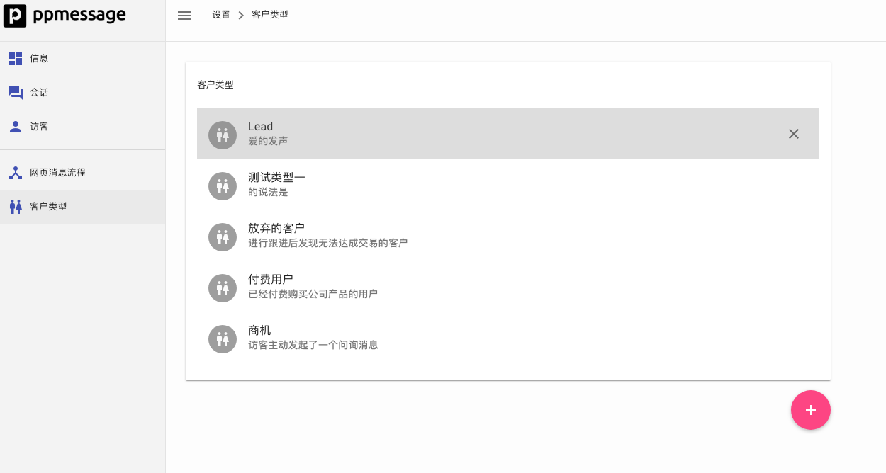

PPMESSAGE 可以实现必要的 CRM 管理功能，您也可以设置 PPMESSAGE 与您的 CRM 系统对接，将用户的客户信息推送给您的 CRM 系统。例如，您可以根据初步接洽客户，深入接触、成单、回款的销售流程将客户设置为不同的客户类型。在 PPMESSAGE 中，您可以将在网页上或应用内主动联系您的用户分类为潜在用户，将提供给您有效联系方式的用户分类为销售商机。这样你就可以分时段统计潜在用户和销售商机数量，从而了解您的工作绩效。

客户类型在“设置-客户管理-客户类型”中设置。

这些客户类型可以在客户详细信息中进行设置，也可以在流程中使用·客户转化·功能对客户类型进行设置。
