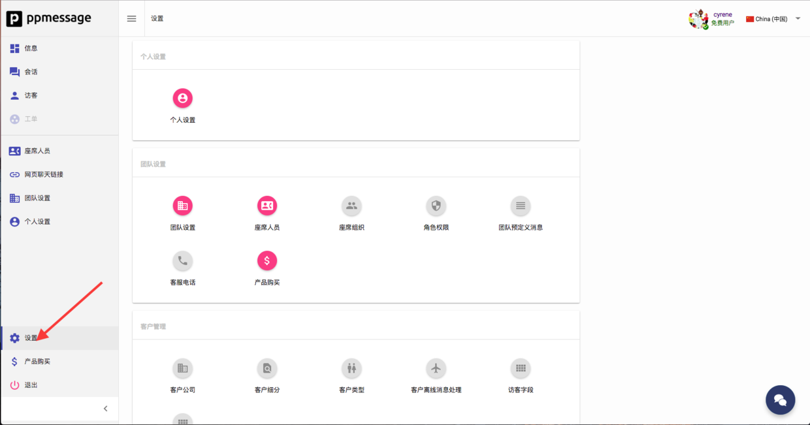
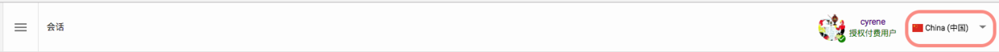
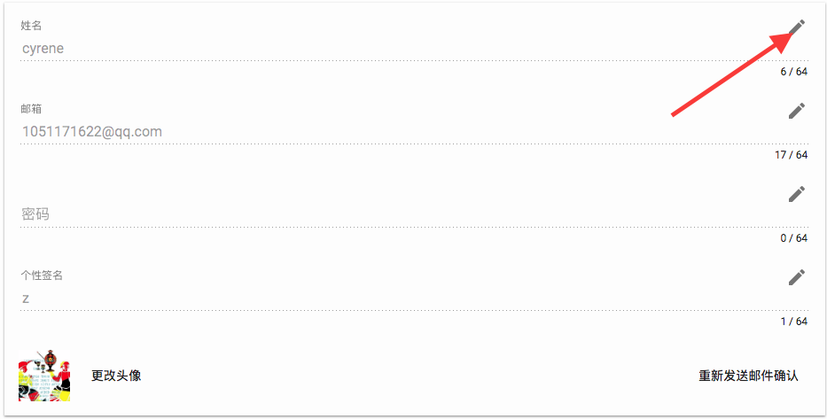
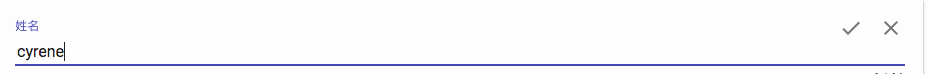
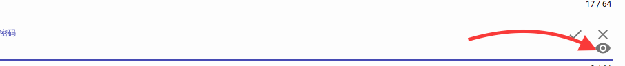
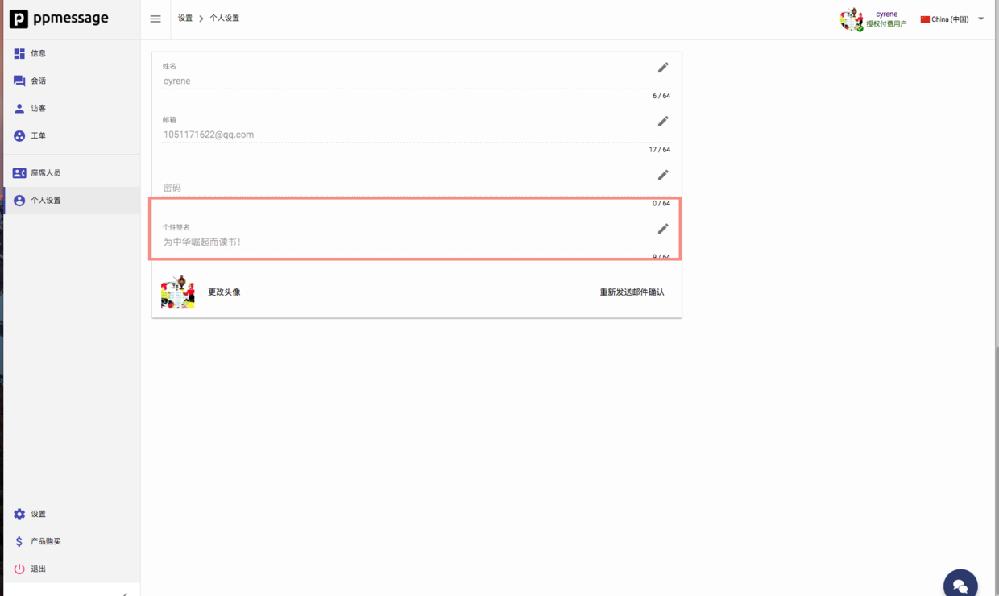
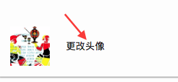

在您登录后 PPMESSAGE 后可以进行个人信息的修改。

点击图中箭头所示区域进入设置界面，然后点击个人设置进行操作。

 PPMESSAGE 可以修改个人信息。
主要功能包括：
- 修改服务语言（目前仅支持中文／英文）
- 修改姓名
- 修改电子邮箱
- 修改密码(默认为登陆密码)
- 修改个性签名
- 修改默认头像（右侧为重发邮件确认设置）

__修改服务语言__：在头像旁边选择服务语言，点击下拉选项框，可以选择英文或者中文服务，修改只针对您个人界面不会影响到团队的其他成员。

__修改姓名__：通过单击下面图标

或者直接点击选项框，然后输入您想输入的新id，通过单击下面图标,对号保存，叉号放弃修改(字符上限为64)。

__修改邮箱__：在这里我们不会验证邮箱是否真实存在但是建议您使用真实邮箱以方便系统发送邮件确认功能的正常使用。修改方法与修改姓名一致。

__修改密码__：这里我们不会让你输入两次进行确认。你要记住你修改之后的密码。

来清楚的看到您修改后的密码,确保密码修改正确。点击对号密码修改完成。修改方法与修改姓名一致（字符上限为64）。

__修改个性签名__：在个性栏中输入您想写的签名即可。个性签名会出现在访客的聊天界面。

访客与座席聊天时，访客悬浮在座席头像时就能看到效果。

__更改头像__：点击箭头所示摁钮进入选择文件界面，选好文件后提交即可，需要注意您修改头像后需要重新登录才能见到效果。

__重新发送邮件确认__：此功能点击后会向您当前的注册邮箱（若修改邮箱，即向新邮箱发送），发送验证邮件确认此邮箱真实有效。可以用这个邮箱帮你找回密码。

