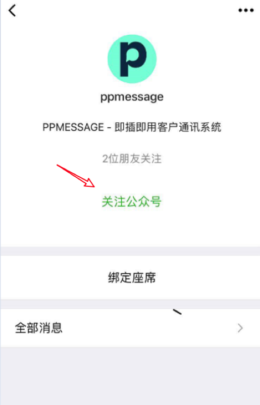
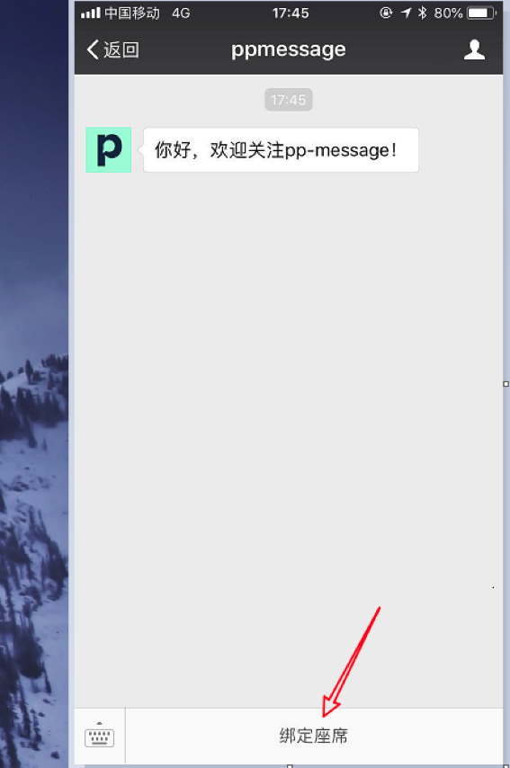

座席人员可以通过自己的微信收到访客信息的提醒。这样当座席人员离开座席系统，并仍然想收到访客消息推送。

座席人员关注PPMESSAGE的公众号。PPMESSAGE 公众号会让座席人员输入账号密码，把座席人员与该微信绑定，这样当座席离线的时候，访客的消息就会通过 PPMESSAGE 公众号推送到座席人员的手机上。

用微信扫描上方的二维码，

点击“关注公众号”，

点击绑定座席，输入您在 PPMESSAGE 的使用的账号和密码，微信提示座席绑定成功后，您就可以通过微信接收和访客消息的推送了。