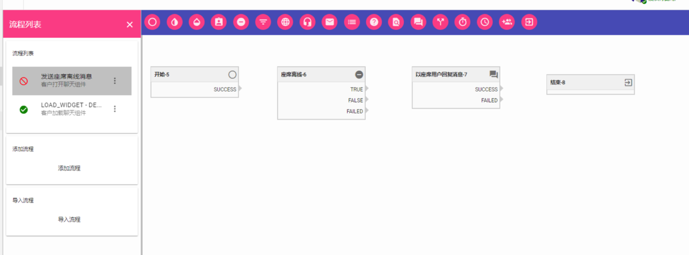

## 简介

访问“设置-流程管理”项下的任何一个流程按钮，您将进入流程配置界面。PPMESSAGE 所有的流程配置界面都是相同的。左边栏是流程列表，流程列表中的每一项都代表一个流程。每个流程项目有四个元素，流程状态，流程名称，流程类型，流程操作菜单。您还可以通过左边栏创建新的流程或导入已保存的流程。

流程状态指明这个流程是否是处于激活状态。绿色表示激活，红色表示未激活，您可以通过流程操作菜单更改流程状态。同一类型的流程最多只能有一个处于激活状态。

系统内部并没有对重复的流程名字进行限制，即使是同样的名字也可以是不同的流程。强烈建议您给每一个流程起一个易于区分的名字。

流程类型标识流程的类别，不同类别的流程具有不同的触发方式。例如，对于网站的访客行为，PPMESSGAE 支持三种流程类型:

- **客户加载聊天组件:** 当客户加载聊天组件，即当客户加载您的网页并能看到聊天组件的时候，执行该流程。刷新网页会反复执行这个流程。

- **客户打开聊天组件:** 客户打开聊天窗口的时候执行该流程。

- **客户在聊天组件上发送了一条消息:** 当客户在聊天组件上发送了一条消息时，执行该流程。

进入流程操作菜单，您可以打开、启动、停止、删除和导出流程，您还可以查看流程实时日志。

创建新的流程或点击您希望编辑的流程，您就进入流程编辑窗口。流程编辑窗口上方是工具栏，工具栏内是对应于流程类型的节点按钮，这些节点只适用于当前的流程类型，不同的流程类型有不同的节点支持。

## 创建流程

一个完整的流程由开始节点开始，结束节点结束，中间包含若干节点，每个节点对应一个独立的操作，节点间通过节点的操作结果和事件响应、变量参数传递建立联系，从而构成一个完整的流程。

以创建一个“客户打开聊天组件”类型的网页消息流程。该流程激活后，如果访客打开聊天组件，流程将得到执行。我们希望流程能够判断目前是否有座席在线，如果有座席在线，流程直接结束；如果没有座席在线，系统自动发送一条消息给访客，内容为“很抱歉目前没有座席在线，您可以在下方对话框留下联系方式，我们将尽快联系您”。

首先，访问 “设置-流程管理-网页消息流程”，进入网页消息流程配置界面。

PPMESSAGE 缺省运行了一个“客户加载聊天组件”流程。在您对流程概念不了解之前，请不要随意更改这个缺省配置，否则可能会导致聊天组件与后台无法建立正常连接。

点击“添加流程”，为您创建的流程选择流程启动时机（流程类型）和设置流程名称。我们选择启动时机为“客户打开聊天组件”，设置流程名称为“发送座席离线消息”。

点击“√”，流程创建成功，流程列表中将出现一个名为“发送座席离线消息”的流程项。

点击这个流程项，进入“发送座席离线消息”流程的编辑界面。

您可以看到工具栏上有很多流程节点，鼠标悬浮流程节点上会显示节点名称。

一个流程必须有“开始”节点和“结束”节点。根据我们的需求，我们还需要一个“座席离线”节点来判断是否所有座席都处于离线状态；一个“以座席用户回复消息”节点，来给新用户发送座席离线消息。

将相应的节点拖拽到编辑区域。

所有的节点都是可以拖拽的，双击节点，就可以进入节点编辑界面。以下四种操作是绝大多数节点的通用操作，不同的节点还有一些其他的配置选项。系统会给每一个节点一个缺省名称，强烈建议您给每个节点设置一个容易理解的名称。您可以随时更改节点名称。如果您想删除某个节点，点击这个节点，节点会出现一个黑色边框，通过键盘的删除键您可以将它删除。

本流程中，“开始”节点成功执行后的下一个节点需要判断座席是否离线，所以我们为“开始”节点添加连接。

点击“√”，连接添加成功，“开始”节点和“座席离线-6”节点之间已经生成一个流程连接线，在节点编辑界面的“连接”区域，生成了一个连接项，指明节点运行结果是“SUCCESS”时下一个节点是“座席离线-6”。

退出“开始”节点编辑界面，进入“座席离线-6”节点的编辑界面。首先，给这个节点设置一个易于识别的名称，我们给他命名为“判断座席是否离线”。名称修改后，所有引用该节点名称的其他节点里对应的名称都会变为“判断座席是否离线”。我们为这个节点添加两个连接，节点执行结果为“TURE”时，即当前没有座席在线时，下一个要执行的节点为“以座席用户回复消息-7”；节点执行结果为“FALSE”时，下一个要执行的节点为“结束-8”。为了更好的看到连线状况，可以拖拽节点调整位置。

退出“判断座席是否离线” 节点，进入“以座席用户回复消息-7”编辑界面。修改节点名称为“给用户发送离线消息”。勾选“以机器人回复”，渠道选择“网页”，消息源选择“文本”，内容更改为“很抱歉目前没有座席在线，您可以在下方对话框留下联系方式，我们将尽快联系您。”。我们为这个节点添加一个连接，节点执行结果为“TURE”时，下一个要执行的节点为“结束-8”。

这样流程就配置结束了。启动流程，流程就进入工作状态了。

流程启动后，若当访客打开聊天组件且没有座席在线时，他将收到一条离线消息。

您可以通过拖拽的方式更快的建立节点之间的连接。点击节点右侧的三角号，会生成一条虚线，将虚线拖拽至希望连接的节点左侧，节点会出现一个三角，再点击这个三角就会生成一个实的连接线。如果希望删除这个连接，点击连接线，等连接线变成黑色后，利用键盘的删除键可以将连线删除。

