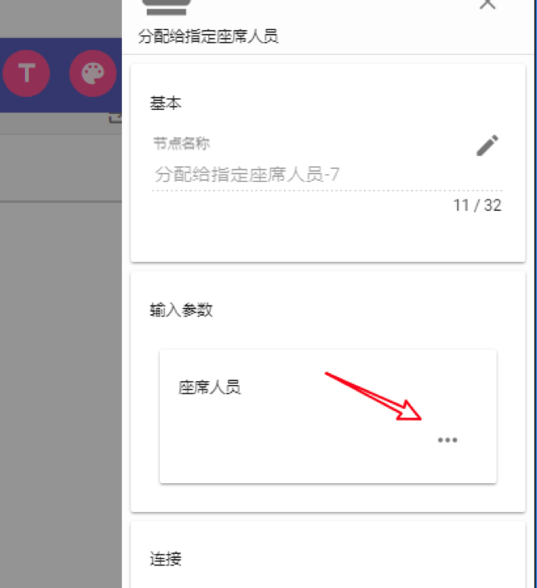

一个完整的流程由开始节点开始，结束节点结束，中间包含若干节点，每个节点对应一个独立的操作，节点间通过节点的操作结果和事件响应、变量参数传递建立联系，从而构成一个完整的流程。PPMESSAGE 的流程很多节点，也有一些节点是某些流程特有的，还有一些节点被某些流程类型共享。下面将介绍主要节点的使用方法。

### “开始”节点
所有的流程都通过开始节点开始。一般来说，开始节点不需要特殊配置，只需添加连接将节点执行结果“SUCCESS”指向下一个节点即可。

### “结束”节点

所有流程都通过结束节点结束，一般来说，开始节点不需要特殊配置，只需把需要结束的结束的节点指向它即可。

### “逻辑运算”节点

逻辑运算节点的功能是通过逻辑运算表达式的运算结果引导流程走向不同的分支。节点的执行结果有三种 TRUE, FALSE和FAIL。TRUE和FALSE对应逻辑运算表达式的运算结果。FAIL是指本节点没有正确执行，一般只在调试时使用。
逻辑运算表达式的语法与Python 的语法一致。例如，如果您想判断当前访客是否是已经分配了客服的访客，您可以使用系统内置变量is_assigned_user来进行判断，逻辑表达式为：is_assigned_user==TRUE。如果您想判断访客的浏览器类型是否为Chrome，您可以使用系统内置变量browser_name，逻辑表达式为：browser_name==“Chrome”。

### “分配给全体座席人员”节点

本节点的将当前消息对话分配给全体座席成员。节点执行成功后每个成员都能看到这个对话，并能回复和处理。
本节点有2个执行结果，执行成功的返回结果为SUCCESS, 执行失败的返回结果为FALSE。

### “分配给一个座席人员”节点

本节点的执行结果将当前消息对话随机分配给全体座席成员的一位。您可以通过节点配置界面的复选框选择要求被分配的座席人员必须在线，但如果所有的座席都不在线将导致本节点执行失败，访客端聊天组件无法与后台正常建立连接。
本节点有2个执行结果，执行成功的返回结果为SUCCESS, 执行失败的返回结果为FALSE。

### “分配给指定座席人员”节点

本节点的执行结果将当前消息对话分配给节点指定的一个座席人员。进入节点配置界面，点击下图所示按钮，即可选择座席人员。

本节点有2个执行结果，执行成功的返回结果为SUCCESS, 执行失败的返回结果为FALSE。

### “分配给座席组”节点

本节点的执行结果将当前消息对话分配给节点指定的座席组。您可以在节点配置界面内选择消息对话在指定座席组内的分配方法。PPMessage提供两种分配方法，一种是”分配给组内所有座席”，一种是“随机分配给一个座席”。
选择“分配给组内所有座席”，消息对话将分给组内的所有座席，无论座席是否在线。
选择“随机分配给一个座席”，系统将把该消息对话随机分配给指定座席组内的一个座席。“随机分配给一个座席”时，您可以选择在线座席优先。如果您选择了在线坐席优先，则该消息对话对话将优先分配给在线的座席。如果所有的座席都不在线，系统会随机选择一个离线座席。
本节点有2个执行结果，执行成功的返回结果为SUCCESS, 执行失败的返回结果为FALSE。

### “座席离线”节点

本节点用来判断是否全部座席都处于离线状态。
本节点有3个执行结果，。如果所有座席离线，执行结果为TRUE；如果有座席在线，执行结果为FALSE；如果本节点没有正确执行，执行结果为FALSE，一般只在调试时使用。

### “已经分配座席”节点

本节点用来判断是否全部当前访客是否已经被分配座席为其提供服务。
本节点有3个执行结果，。如果已经分配座席，执行结果为TRUE；如果未被分配座席，执行结果为FALSE；如果本节点没有正确执行，执行结果为FALSE，一般只在调试时使用。

### “以座席用户回复消息”节点

本节点是PPMESSAGE系统非常重要的一个节点，用来向访客发送自动消息。本节点的配置内容较多，详细说明如下。

**以机器人回复**：系统既可以以机器人的身份也可以以座席的身份向访客发送自动消息。如果您选择了以机器人的身份回复消息，则系统后台会提示是机器人回复了消息。如果不以机器人回复消息，您需要在座席人员选项了选择希望回复消息的座席人员。

**不要推送给座席**：如果选择把回复消息的事件推送给座席，则本次对话内所有的座席人员都会收到给访客发送的自动消息；如果选择不要推送给座席，则座席不会受到提示。

**渠道**：渠道是您选择向访客发送自动消息的通道。您可以选择通过网页消息、移动应用内消息、邮件和短信四个渠道之一向访客发送消息。

**消息源**：消息源是您要送的消息的来源。PPMessage提供两种选择，一种是预定义消息，您可以在“设置-团队设置-团队预定义消息”界面里预先定义您要发送给访客的消息；一种是文本，您可以在节点中添加文本内容。您可以在文本中应用变量。例如，如果您希望通过注册用户的名字向他们打招呼，您可以通过应用系统内置变量user_fullname来实现。假设您设置的文本内容为“{{user_fullname}},欢迎注册使用我们的产品”，有一个叫琳琳的用户触发了这条自动消息，则她将收到的消息是“琳琳，欢迎注册使用我们的产品”。

**座席人员**：您可以选择以某个座席人员的身份回复消息。
本节点有2个执行结果，执行成功的返回结果为SUCCESS, 执行失败的返回结果为FALSE。

### “超时”节点

超时节点可以让流程在此处暂停超时指定的时间，在这个时间内，流程如果没有收到任何感兴趣的事件，那么就会产生超时事件结果，执行超时事件结果对应的下一个节点。
超时节点的配置主要有两部分。

- 设置等待超时的时间。可以选择从**1秒到604800秒（7天）**的固定时间。
- 设置节点执行的执行结果。主要使用的节点执行结果是**TIMEOUT超时事件**和**USER_ANSWER**座席回答事件，其他的执行结果与云呼叫中心的配置有关，将在云呼叫中心的配置文档中详细说明。
超时节点可以帮助您做很多与时间、事件相关的事情。下面举一个例子说明。
其使用情景是这样，当客户发送一个消息给座席，这时候座席虽然登录了，但是他可能正在忙于处理别的事情，所以暂时没有回复客户，当然希望客户再稍等一下，座席可能就会回复了。这时候需要系统根据客户的等待时间超过比如15秒钟，就自动回复一条消息，告诉客户座席在线，只不过手里有事，比较忙，很快就会回复。
我们在网页消息流程中的配置一个客户发送消息流程：

这个流程会在每次客户发送一条消息的时候执行，判断当前会话中所有座席是否都不在线，如果都不在线，那么就把客户发送的消息以微信模板消息的形式推送给座席。
如果座席在线，那么就进入一个超时节点，在这个节点上流程将等待事件发生，这个流程中超时节点只关心一个事件， TIMEOUT 事件，只要这个事件产生，那么超时节点将执行返回事件结果对应的下一个节点。本流程中，这个节点是以某个座席回复一条消息给客户。这就是一个通过检查超时进行客户忙碌状态的提示，这样尽可能的让客户留下，不要轻易离开。

### “座席工作时间”节点

通过“座席工作时间”节点您可以设置座席工作的时间，这样，当座席不在工作时间时，您可以给访客发送消息提示，或通过销售机器人获取客户信息。
本节点有3个执行结果，如果流程执行到本节点时处于设置的工作时间，执行结果为TRUE；如果流程执行到本节点时处于设置的非工作时间，执行结果为FALSE；如果本节点没有正确执行，执行结果为FALSE，一般只在调试时使用。

### “属于客户细分”节点

本节点通过获取“设置-客户管理-客户细分”里的客户分组信息，对特定细分里的用户执行操作，如发送自动消息，分配座席等。系统缺省有“活跃访客”、“新访客”和“在线访客”三个细分，您可以根据实际需要创建新的细分，并在本节点引用。
本节点有3个执行结果，。如果触发流程的访客属于本节点引用的客户细分，执行结果为TRUE；如果触发流程的访客不属于本节点引用的客户细分，执行结果为FALSE；如果本节点没有正确执行，执行结果为FALSE，一般只在调试时使用。

### “客户转化”节点

本节点可以根据流程的设置，改变访客的客户类型。您应该在“设置-客户管理-客户类型”中设置您的客户类型。这项功能可以使您根据客户的行为和属性设置客户转化，从而完成销售漏斗的功能。
本节点有2个执行结果，执行成功的返回结果为SUCCESS, 执行失败的返回结果为FALSE。

