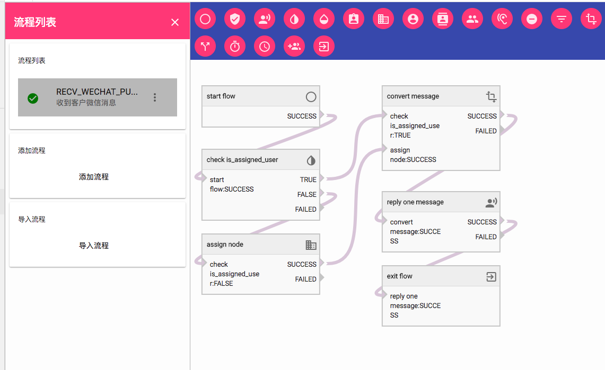

PPMESSAGE  可以对接您的微信公众号，这样通过 PPMESSAGE 可以收到客户通过微信公众号发送过来的文本消息。

> 微信公众号必须是服务号，并且是那种所谓‘认证’过（交过300 RMB）。

当然你也要购买 PPMESSAGE 的付费服务，才有微信客服的功能。

### 操作过程

访问 ·设置 - 第三方服务 - 微信集成（公众号）·

点击 “微信公众号授权”的按钮，使用微信公众号管理员的微信扫描出现的二维码，确认授权给 PPMESSAGE。

### 检查流程

访问 ·设置 - 流程管理 - 微信消息流程（公众号）·

检查是否有“收到客户微信消息”的流程：

每次 PPMESSAGE 收到来自微信公众号的的客户消息都会走一遍这个流程，这个流程负责检查这个客户是否是老客户，是否需要分配座席，然后把消息从微信公众号中转化成 PPMESSAGE 消息，同时给微信公众号系统回复一个空消息，让微信公众号系统知道这个消息已经被正确接收。

流程图如下：

在微信公众号流程中也支持管理者自己定制流程通过点击添加流程按钮手动添加流程控制，管理者还可以通过直接导入的方式直接导入流程（更为方便）。

