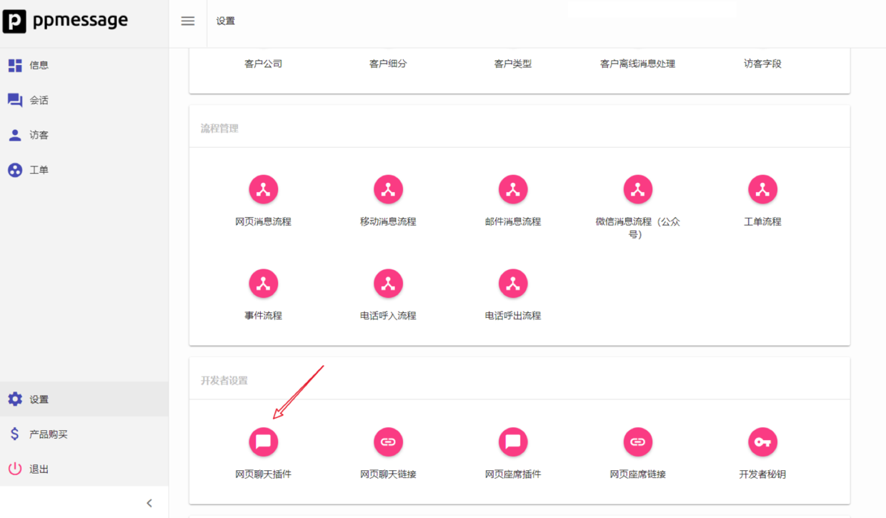
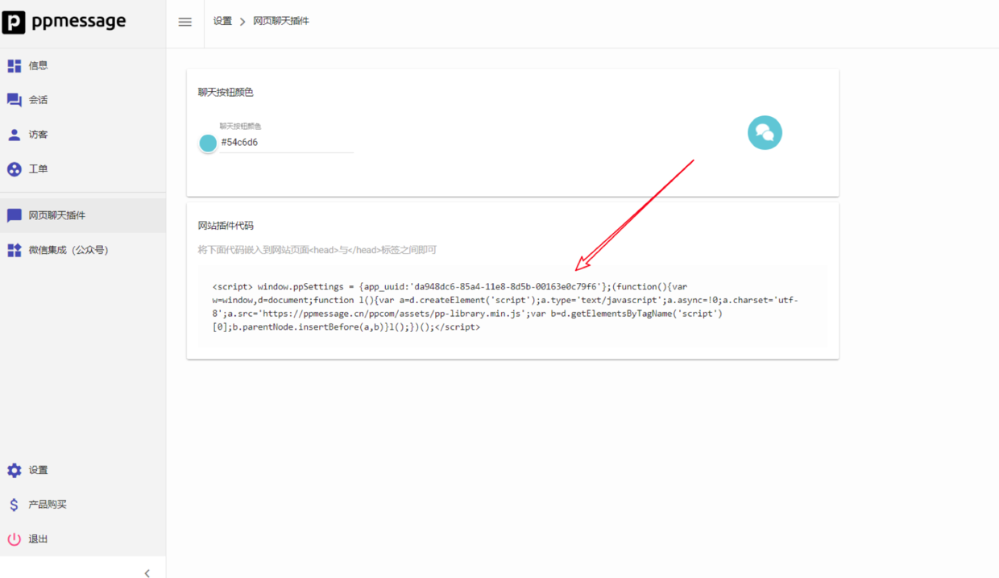

您只需几分钟即可在您的网站上安装 PPMESSAGE。安装完成后，您将能够查看并与您应用里的登录用户聊天。

## 创建账户
首先，在 PPMESSAGE 主页上输入您的电话号码并创建您的账户。

接下来，开始免费试用。以下是免费试用版的主要功能:

1. 您将获得在线版本产品的免费试用。超出一个座席需要付费使用。
2. 免费使用不能添加座席，不能改变主页上显示的应用信息。但是可以开发消息内应用，可以定制属于自己的消息流程。
3. PPMESSAGE 支持私有部署，源码开放支持，如果您想了解更多，可以随时通过在线客服与我们的服务人员联系。

## 安装 PPMESSAGE 前端聊天组件
创建账户后，您需要在您的网站上安装 PPMESSAGE 的 JavaScript 代码。

在设置界面中找到 “网页聊天插件” 的按钮并点击。



将网页插件代码复制粘贴到您的网站页面 <head> 与 </head> 标签之间即可完成 PPMESSAGE 组件安装。



## 隐藏聊天按钮

在上述的代码中有 ppSetttings 这个对象，其中 hide_launcher 可以用来隐藏聊天按钮。

```javascript

window.ppSettings = {
    hide_launcher: false,
    server_url: "http://192.168.0.51:8945",
    app_uuid: "8c9acf5e-545c-11e9-999c-58b035f16bf4"
}

```

> 注意 server url 和 app uuid 都是测试用的，您只需保持原来的值即可。
