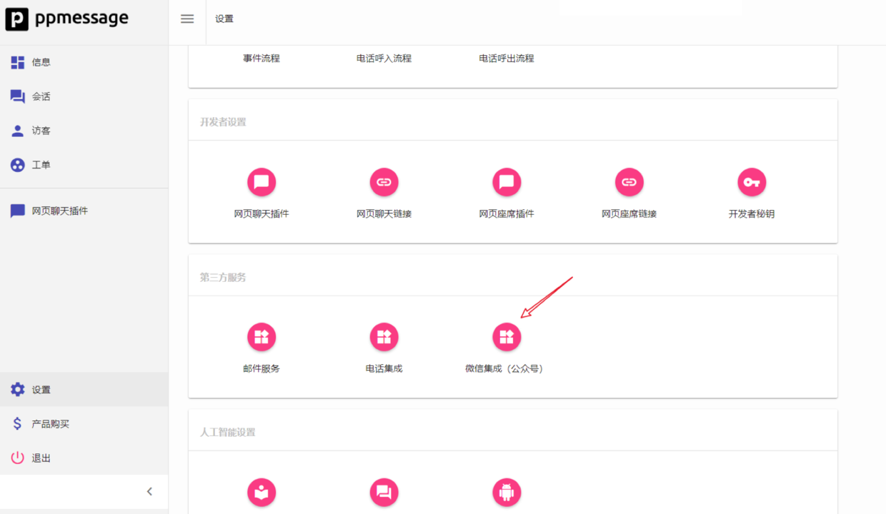
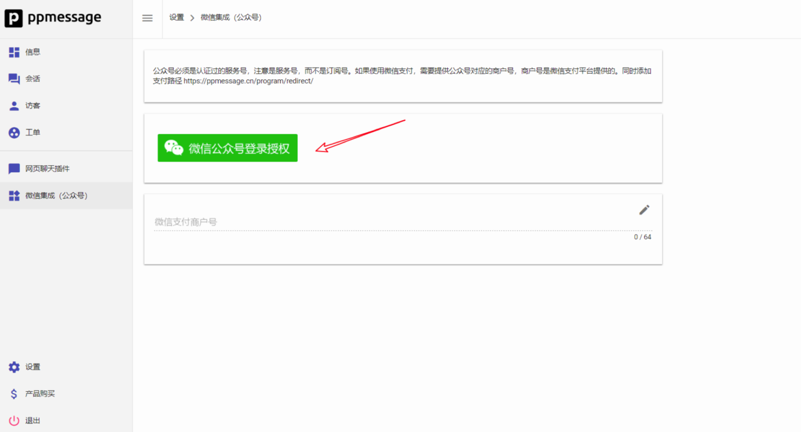

PPMESSAGE 可以对接微信公众号，通过 PPMESSAGE 可以收到客户通过微信公众号发送过来的消息，您可以使用PPMESSAGE 系统进行客户支持。

>微信公众号必须是服务号，并且是那种所谓‘认证’过的（交过300 RMB）。

## 操作过程
访问“设置 - 第三方服务 - 微信集成（公众号）”。

点击 “微信公众号授权”按钮，使用微信公众号管理员的微信扫描出现的二维码，确认授权给 PPMESSAGE。

授权成功后，您就可以使用PPMessage为您的微信客户提供在线服务了。

