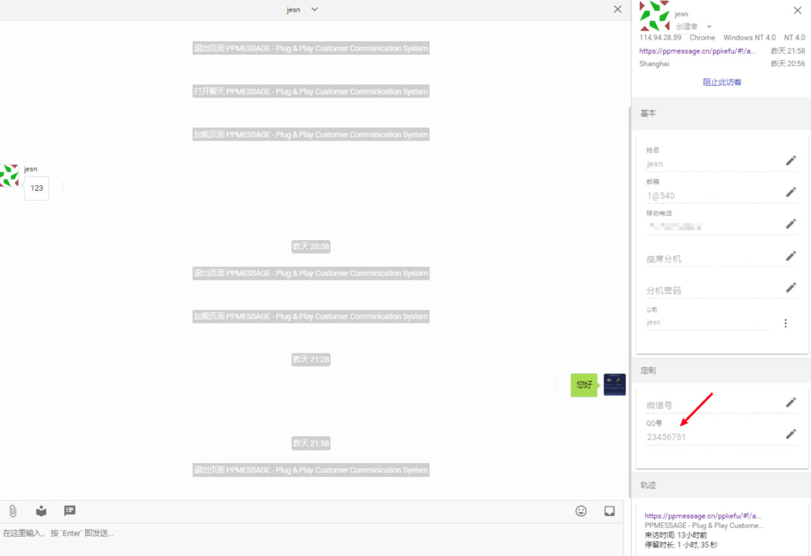

如果您希望通过您的业务系统的数据实时更新 PPMESSAGE 中的某些标准字段和定制字段的值，您需要在网页客户端为访客的定制字段设置值，这样可以便于给访客细分并对细分的访客组执行不同的操作。

### 自动更新系统标准字段

如果新希望将您的业务系统里用户ID、姓名、头像、手机号码、电话号码和创建时间传递给 PPMESSAGE, 您需要在网页聊天插件代码添加以下内容，注意要把 null 替换为您业务系统中对应的字符串。

```
window.ppSettings = {
 ent_user_id: null,
 ent_user_name: null,
 ent_user_icon: null,
 ent_user_mobile: null,
 ent_user_phone: null,
 ent_user_qq: null,
 ent_user_wechat: null,
 ent_user_create_time: null
};

```

这样座席就能看到您设定的用户信息。其中 `ent_user_id` 是指企业用户标识，这个 ID 来自您的系统，您用这个标识来分辨每个不同的客户；`ent_user_icon` 必须要用绝对的 URL 地址，如果在 PPMESSAGE 显示您的客户的头像，这个链接必须是绝对的 URL；`ent_user_create_time` 这个数据用来标识用户转化，因为这是一个注册用户（您都有 ID 标识了），那么创建时间就意味着您成功获取这个客户的时间。

## 更新定制字段

如果您在系统中设置了定制字段，并且希望通过业务系统的数据更新它的值，您需要在网页聊天插件代码中添加如下内容。本例中，`extra_field_TEXT_3` 是我们在前面设置的定制字段的 `QQ号` 的内部名称。您在进行配置时，要把代码中的 `extra_field_TEXT_3` 替换为“设置-客户管理-访客字段”中对应定制字段的内部名称。下面的代码必须确保在聊天组件已经成功加载的情况下执行。

```
window.PP.setVar({"extra_field_TEXT_1": "Hello World"}, function() {
  //成功设置      
}, function() {
  //设置失败
});

```

代码执行后，客户信息的定制字段部分将显示更新后的信息。



