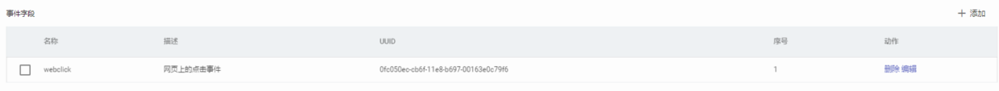
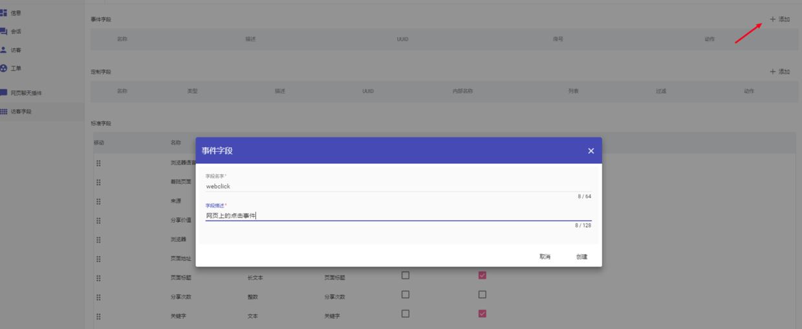
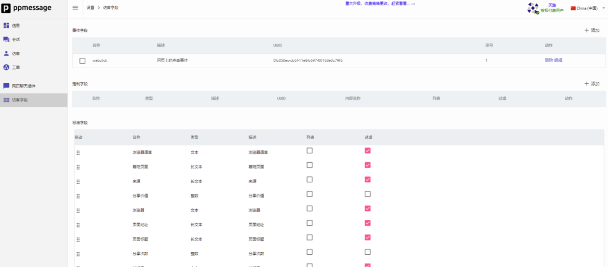

打开 “设置 – 客户管理 - 访客字段”，可以自定义事件字段，自定义事件字段可以含有一个事件发生的次数，首次发生事件的时间，最后一次发生事件的时间，以及最后一次事件发生时候携带的数据。
在后台流程中可以引用或者读取这些变量，其命名规则为 `event_count_SEQ`，`event_first_time_SEQ`， `event_last_time_SEQ`， `event_last_data_SEQ`。其中 SEQ 是序列号。



上图中定义了一个网页上的点击事件，为了跟踪这个事件，您需要在网页聊天插件代码中添加如下内容:

```
$(document).on("click", function(event) {
if (!window._ppmatc) {
  window._ppmatc = [ ];
}
window._ppmatc.push({
  track_event: {
    event_name: "webclick",
    event_uuid: "0fc050ec-cb6f-11e8-b697-00163e0c79f6 ",
    event_data: {
      x: event.pageX,
      y: event.pageY,
      page_url: window.location.href
    }，
    event_timestamp: Math.round(new Date().getTime()/1000)    
  }
});
});

```

因为这个事件字段在系统中的序号是 1，在后台流程中可以通过 `event_count_1`，`event_first_time_1`， `event_last_time_1`， `event_last_data_1` 来引用这些变量。
`event_count_1` 是 webclick 事件发生的次数，`event_first_time_1` 是 webclick 事件首次发生的时间，`event_last_time_1` 是 webclick 事件最后一次发生的时间，`event_last_data_1` 是 webclick 事件最后一次发生时携带的数据。


## 设置应用中要跟踪的事件

PPMESSAGE 的事件跟踪功能将用户的基本信息和他们的行为结合起来，可以发送具有高度针对性，相关性和吸引力的消息。 
事件是系统对用户行为进行跟踪的基本数据，通过管理员在管理后台定义，每个事件在访客浏览网页的时候，由开发者控制产生。PPMESSAGE 可以跟踪事件的次数，首次创建时间，最后创建时间，最后更新数据，这些数据可以用来进行访客过滤和创建客户细分。
本文演示了一个 ‘click’ 事件，能够收集客户在网页上的所有的鼠标点击事件，可以做出点击的“热力图”。

## 自定义事件
访问 “设置-客户管理-访客字段”，点击添加新的事件。



PPMessage目前最多允许 8个自定义事件类型。创建完成后，事件字段列表中会出现一个新的事件字段。



## 跟踪事件
为了跟踪网页上的点击事件，您需要在网页聊天插件代码中添加如下内容

```
$(document).on("click", function(event) {

if (!window._ppmatc) {
  window._ppmatc = [];
}

window._ppmatc.push({
  track_event: {
    event_name: "click",
    event_uuid: "xxxx-xxxx-xxxx-xxxxx",
    event_data: {
      x: event.pageX,
      y: event.pageY,
      page_url: window.location.href
    }，
    event_timestamp: Math.round(new Date().getTime()/1000)    
  }
});

});

```

其中 `window._ppmatc` 这个队列会被 PPMESSAGE 定期检查，如果发现有事件数据对象就会上报给后台系统。
上报的数据结构必须如上述代码所描述，是一个 Javascript 对象，并且含有 `track_event` 成员，在 `track_event` 里面要指定 `event_name`, `event_uuid`, `event_data`。其中 `event_name` 和 `event_uuid` 要与 “设置-客户管理-访客字段” 配置的字段信息一致，`event_data` 可以是任意对象。

通过队列技术，使用 PPMESSAGE 的前端开发者无需判读当下 PPMESSAGE 是否已经初始化，直接将数据 PUSH 到 `window._ppmatc` 这个数据队列之中。

