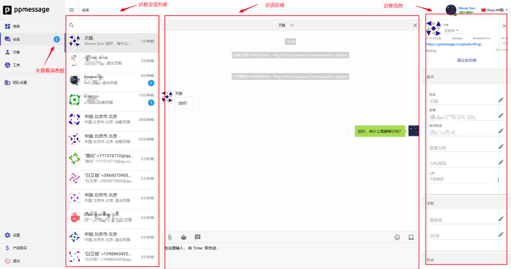
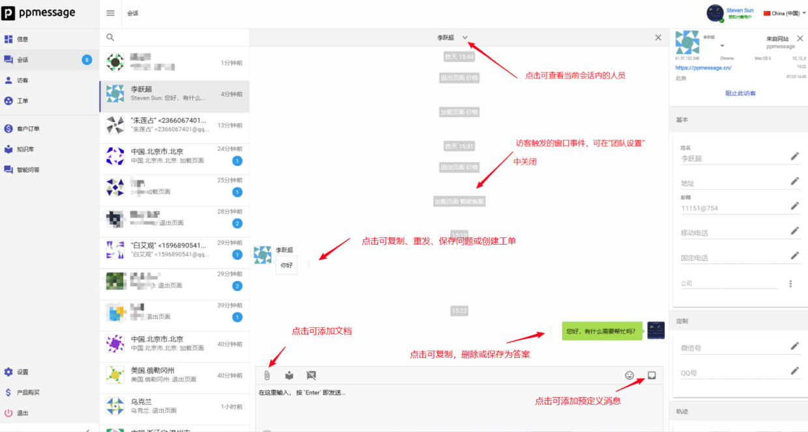
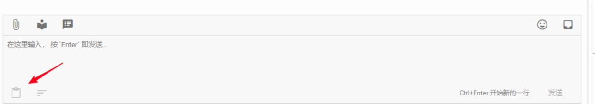
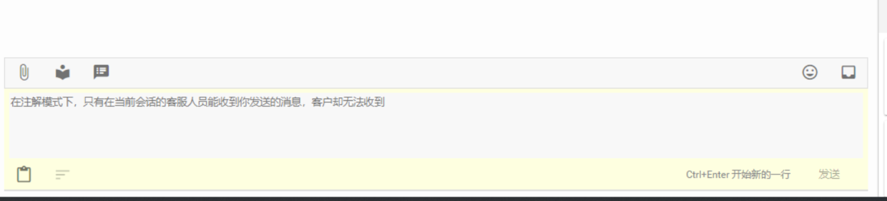
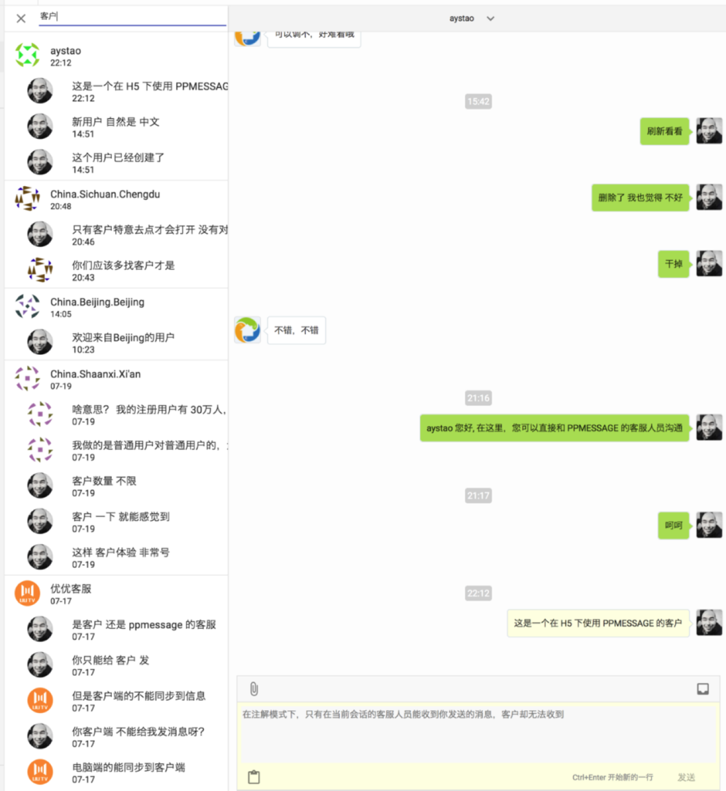
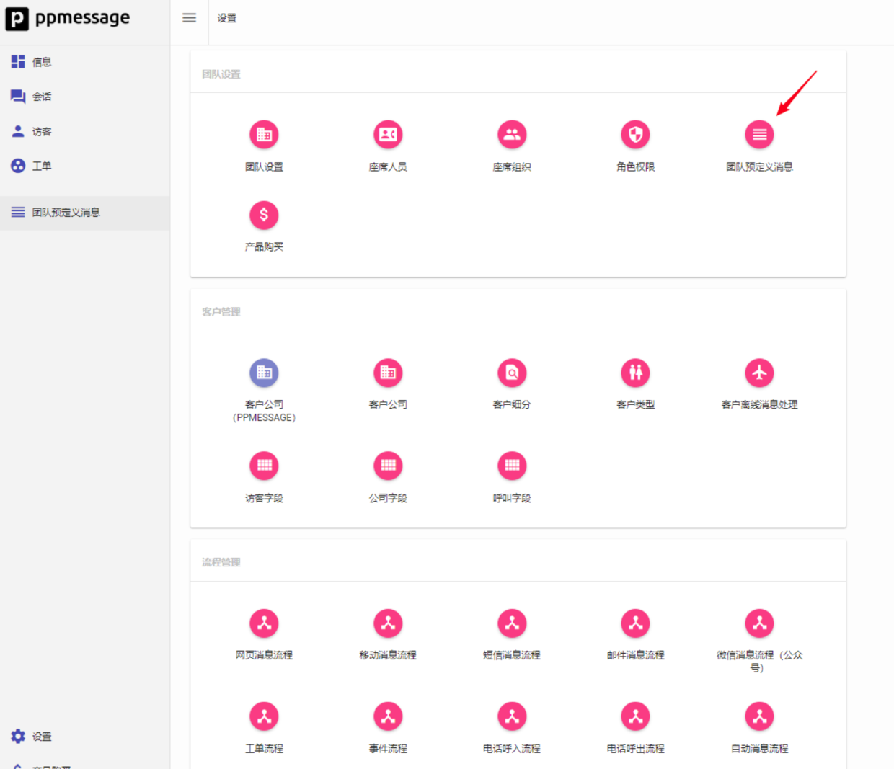

您每次登录 PPMESSAGE 后台，系统默认打开会话界面。会话界面是您处理和回复访客咨询的主要窗口。会话界面分为访客会话列表、会话区域和访客信息三个区域。

PPMESSAGE 用访客的地域作为访客的缺省姓名，您可以在右侧访客信息栏里修改访客姓名，或者通过JavaScript 代码给访客赋值。
PPMESSAGE 通过 Cookie 识别访客，缺省设置下不会主动关闭一个会话。所以，每次访客咨询的时候，您还能看到他的历史聊天记录。

## 会话区域

PPMESSAGE 的会话区域非常适合处理客户问题，相关操作按钮说明如下:

在与访客聊天过程中，座席可以随时记录一些笔记，这些笔记不是想给访客看的，但是跟这个访客有关。

当选择了注解模式，输入窗口会发生变化，发出的消息的背景颜色也不同:

发出的消息可以通过全文搜索搜索出来:

这样日后可以通过某些模糊的记忆找到往日的客户和聊天记录。
使用预定义消息可以方便座席人员快速回复，您可以访问“设置-团队设置-团队预定义消息”设置团队预定义消息。

