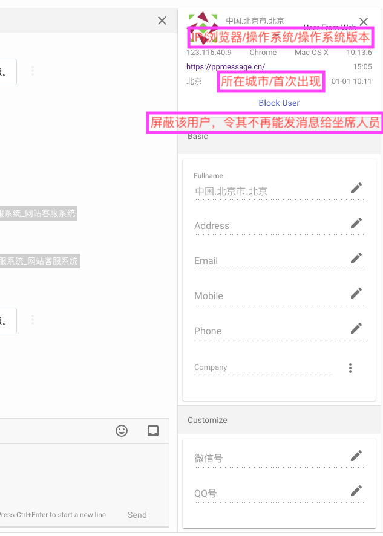
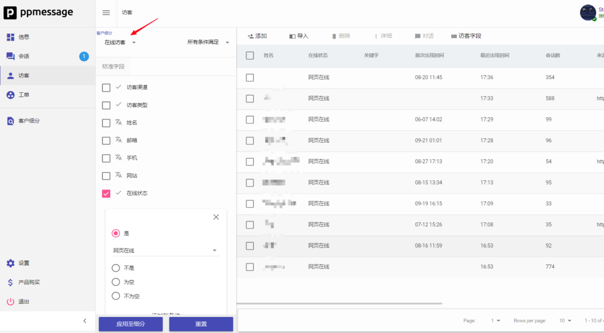
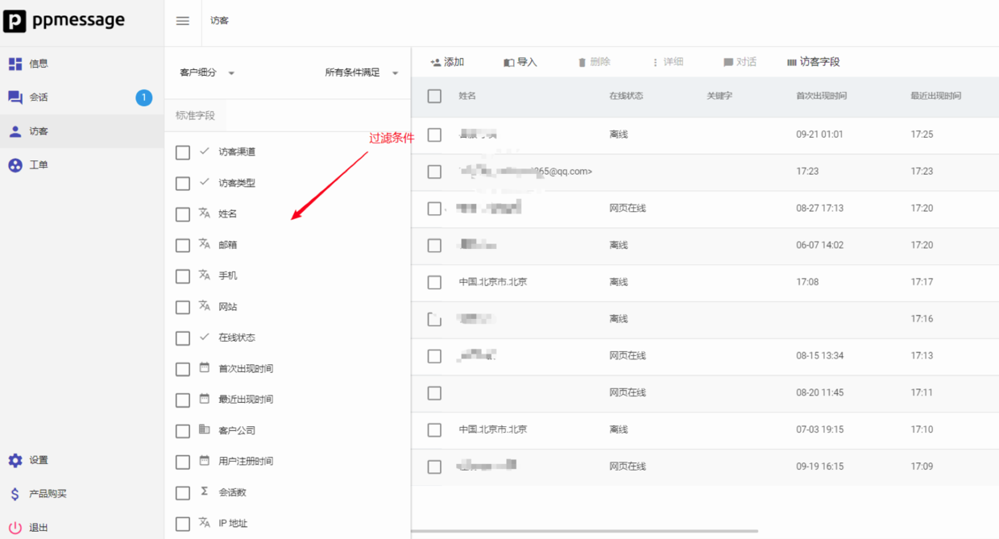
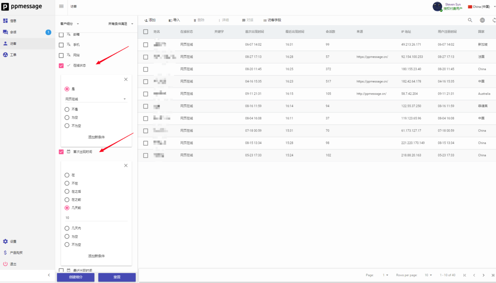

当您在会话界面回答客户的问题时，客户信息会显示在右侧栏中。它可以帮助您快速了解您的客户是谁，他们所在的公司，他们正在使用的浏览器以及其他相关信息。通常，这会提供您以个性化方式回答客户问题所需的所有背景信息。您可以随时了解并记录重要的客户信息，相关字段说明如下:

 PPMESSAGE  可以实时跟踪网站的每一个访客，并且能够精确衡量每个访客在每个页面上停留的时间，与传统的网页跟踪代码机制所不同的是， PPMESSAGE  能够准确记录检查访客的离开某个浏览的网页的时刻。类如 Google Analytics 这样的网页跟踪软件是通过下一个浏览记录来更新上一个浏览记录的离开时刻，这样的做法非常聪明，但是无法计算访客的最后一个网页的停留时间，因为在访客关闭了浏览器后，任何浏览器内的程序都不会得到机会再运行。而  PPMESSAGE  通过实时跟踪解决了这个问题。“轨迹” 中只显示最近16条客户浏览记录，滚动更新。

## 客户细分

在过滤条件列表的客户细分下拉菜单，您会看到自己的细分客户群。 PPMESSAGE 提供三个默认细分:
- 在线访客，当前在线的访客名单。
- 新访客，在当前一天新增的访客名单。
- 活跃访客，(再过去30天内至少登录一次的访客)。
您可以根据您喜欢的任何标准组合创建客户细分，它们将显示在客户细分下拉菜单中。

我们建议您为要向其发送消息的每个关键用户组创建一个细分受众群，例如，试用用户或尚未使用您的产品的注册用户。

## 过滤条件

访客界面的左侧是过滤条件。您可以使用这些过滤条件细分用户，回答特定问题。 PPMESSAGE 为您提供大量有用的数据进
行过滤。我们将此数据称为标准字段。
您也可以向 PPMESSAGE 发送您喜欢的任何数据，以帮助您更好地回答关于用户的问题。您可以向 PPMESSAGE 发送两种类型的数据，这些数据特定于您的用户群：自定义字段和用户事件。它们将与标准字段一起显示在过滤条件栏中。

## 创建细分

要创建细分，首先您需要在用户列表的左侧进行过滤条件设置。例如，如果您希望关注当前网页在线的老用户，您可以创建一个细分满足“在线状态是网页在线”和“首次出现时间是10天前”的客户细分。过滤条件设置好以后，访客列表会实时显示满足过滤条件的访客。如果您对设置的过滤条件不满意，可以点击左下角的“重置”按钮，重新设置。

过滤条件设置完成后，点击“创建细分”并为您的细分提供一个名称（建议您采用易于记忆的内容作为细分名称，例如“当前在线的老用户”）。您的新细分将显示在客户细分下拉菜单中。该细分保存在 “设置-客户管理-客户细分”下面，您在以后的流程里可以引用这个细分，如果不再使用，也可以将它删掉。

## 配置客户信息

 *如何查看，过滤，搜索和细分客户*
在 PPMESSAGE ，我们的使命是使商业个性化。因此，我们可以让您轻松了解每个访客并可以统计分析不同访客群体的行为特征。您可以根据您的业务需要，在 PPMESSAGE 设置特定于您的用户群的自定义用户属性和用户事件。您可以在与客户聊天时记录这些自定义用户属性，也可以通过Javascript代码将这些信息推送给 PPMESSAGE 。这些属性将和 PPMESSAGE 的标准字段一起出现在 PPMESSAGE  访客界面的过滤条件列表里，您可以利用这些属性进行客户细分。

