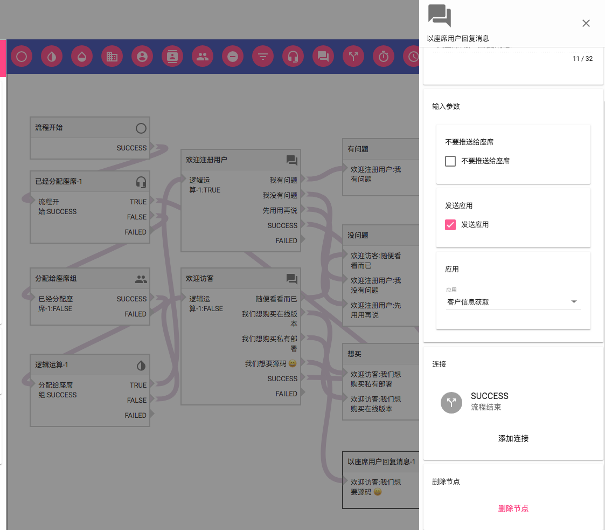
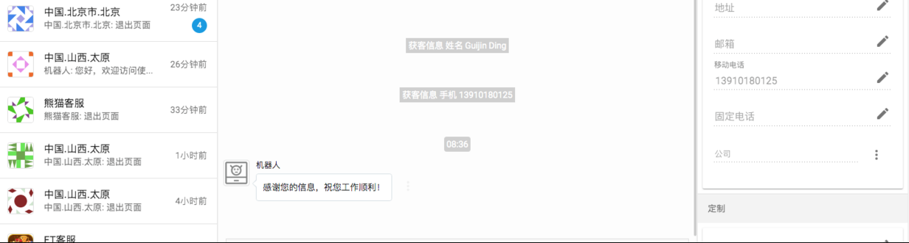
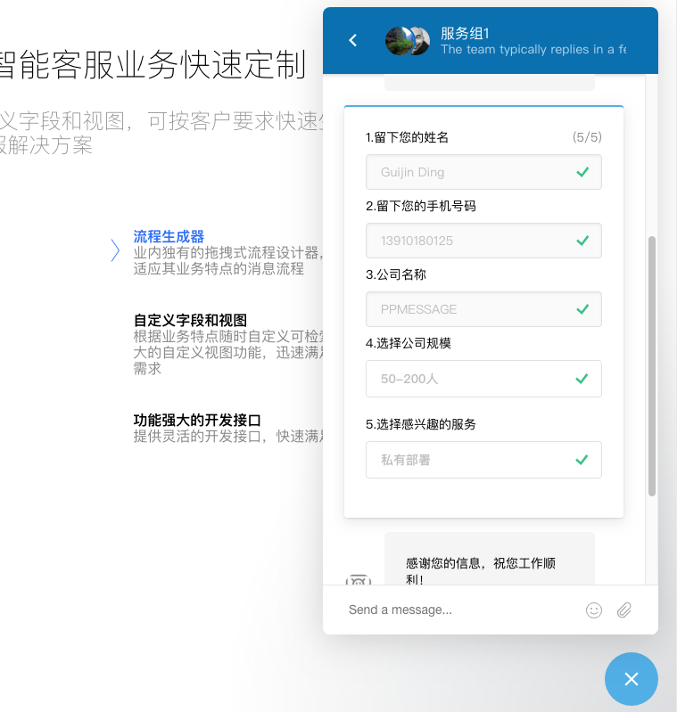

在 PPMESSAGE 中可以在消息会话过程中向访客发送一个客户信息表单，从而收集客户信息，收集到的信息会自动更新访客资料。同时在会话中的座席服务人员也会收到相应的事件提醒，提醒的内容是更新了那些信息。

## 配置使用

可以通过网页消息流程配置使用访客信息表单的功能，访客加载页面、打开聊天或者每次发送消息之时，PPMESSAGE 系统都启动相应的消息流程，在流程内部引用·以座席用户回复消息·这个流程节点，就可以选择发送应用，客户信息获取。当流程的逻辑执行到这里的时候，访客的消息界面上就会出现客户信息表单。

座席服务人员的界面上也能实时看到访客提交的信息：

## 表单内容

姓名、手机号、公司规模、感兴趣的产品等。

获取客户信息表单是一个单独的应用，任何 PPMESSAGE 的注册用户都可以开发自己的应用，需要遵循 PPMESSAGE 的应用集成开发要求。

