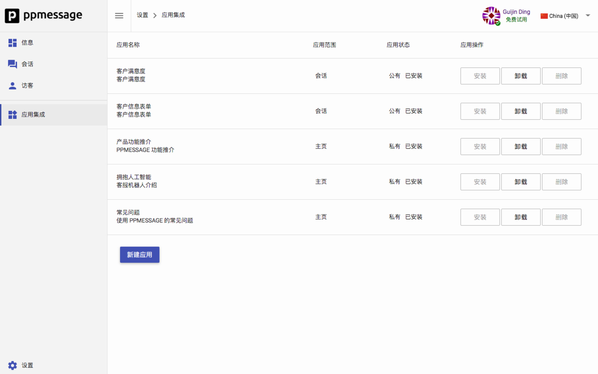
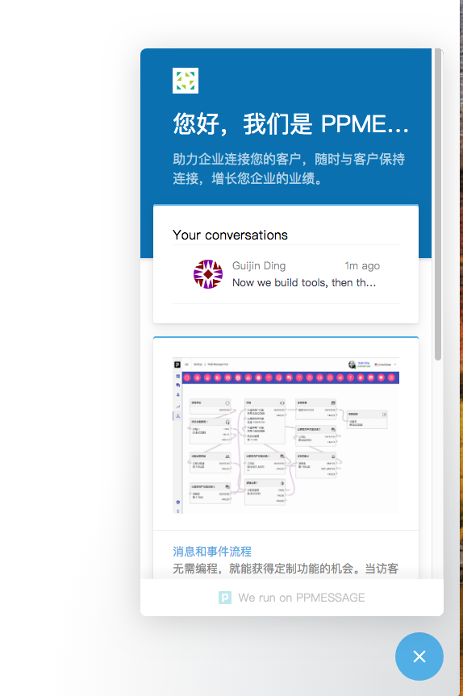

在访客端界面，可以看到主页和会话界面。主页中的消息卡片是通过后台的配置生成。

## 配置使用

可以通过后台配置应用集成，在主页端展示消息卡片。每个消息卡片都是一个应用。这些应用来自 PPMESSAGE 的开发者或者企业自己开发。

每个应用可以配置使用范围，如果选择在主页上展示，那么这个应用的界面就是主页的一个消息卡。每个消息卡都可以进行进一步的交互。可能是通过浏览器打开一个 URL，或者在消息界面中直接打开一个 URL。

## 界面效果

这是 PPMESSAGE 展示的主页卡片，如果您是免费用户，那么您不能改变这个主页，只有付费用户才可以定制这个主页。

下面的例子是个多步骤的交互界面，通过搜索获取 PPMESSAGE 的使用文档。

每个主页的信息卡片都是一个单独的应用，任何 PPMESSAGE 的注册用户都可以开发自己的应用，需要遵循 PPMESSAGE 的应用集成开发要求。
