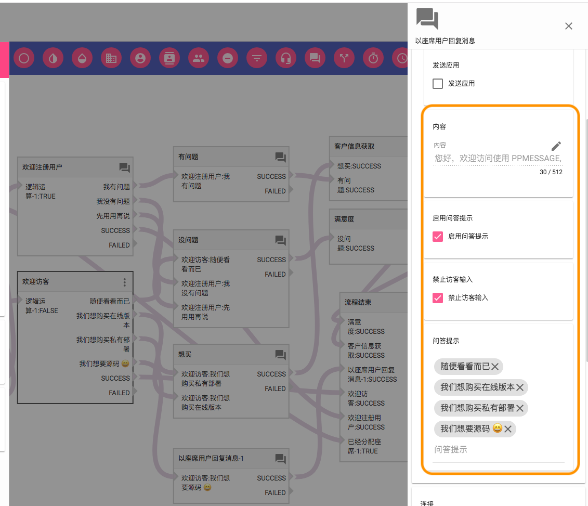
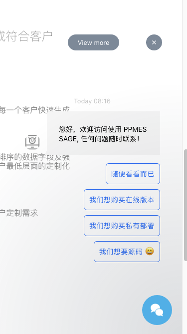
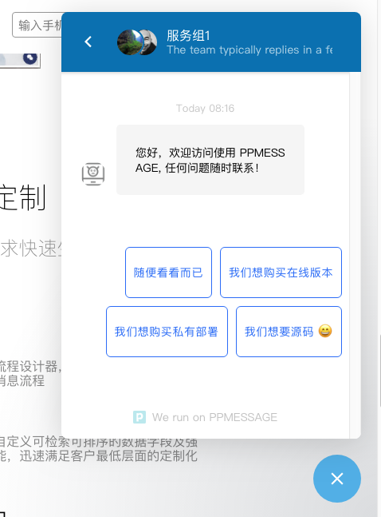

在 PPMESSAGE 系统中可以通过流程设置引导客户发送消息，自动回复消息，完成多个回合的消息会话。

## 配置方法

需要在消息流程中设置，在访客加载网页，打开聊天界面或者发送消息的时候，PPMESSAGE 系统都能有机会向访客推送一组提示，希望访客选择这个提示中的一个，通过流程的设计，不断提示访客，并且按照访客的选择进行自动流程回复，实现多轮对话。

这个功能由流程中的回复座席消息节点完成。

在配置引导消息的时候可以选择关闭输入框，这样客户没有输入信息的选择，只能选择一个预设的提示消息进行回复。如果访客长时间没有选择提示的回复信息，这个回复信息会自动消失，一般是 3 分钟。

## 访客界面

如果在页面加载流程中配置了自动消息提示，访客还没有打开聊天，就会以这种简单方式提示，以免对访客的行为产生过多干扰。

如果访客已经打开了聊天组件，消息回复提示将会显示在整个会话界面的下方，访客可以点击任何一个即回复这个消息。

通过流程的设置可以不断的组织与访客的自动对话，完成服务或者信息收集的工作。