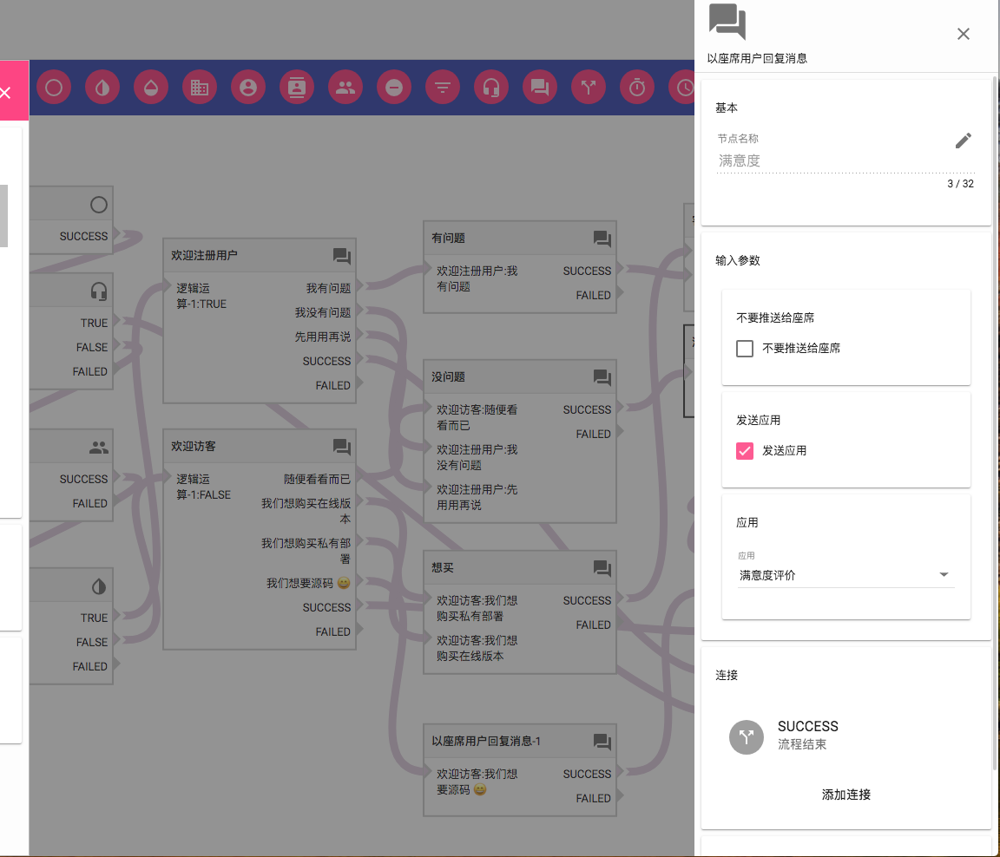
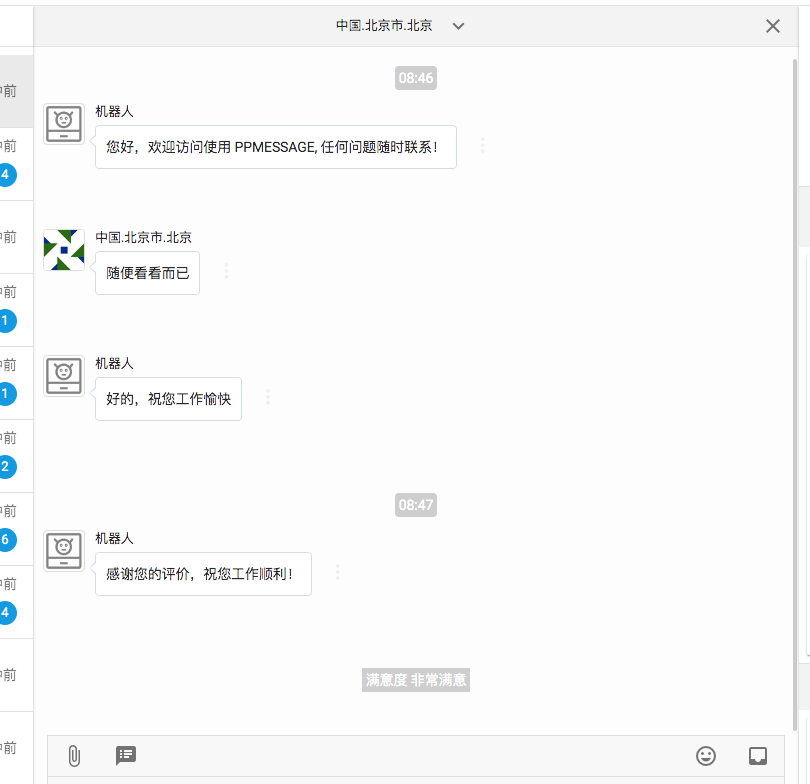
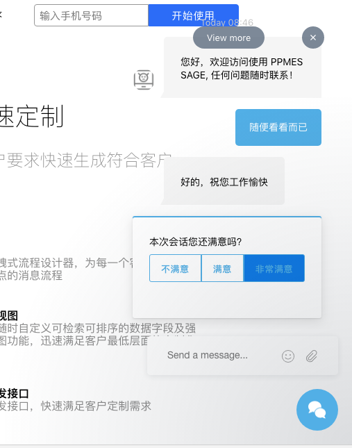

在 PPMESSAGE 中可以在消息会话过程中向访客发送一个客户满意度表单，从而收集客户满意度，收集到的信息会自动更新访客资料。同时在会话中的座席服务人员也会收到相应的事件提醒，提醒的内容是访客的满意度。

## 配置使用

可以通过网页消息流程配置使用客户满意的功能，访客加载页面、打开聊天或者每次发送消息之时，PPMESSAGE 系统启动相应的消息流程，在流程内部引用·以座席用户回复消息·这个流程节点，就可以选择发送应用，客户满意度。当流程的逻辑执行到这个节点的时候，访客的消息界面上就会出现客户满意度表单。

座席服务人员的界面上也能实时看到访客提交的信息：

## 表单内容

客户满意度是三个按钮，分别表示不满意、满意、非常满意。

客户满意度是一个单独的应用，任何 PPMESSAGE 的注册用户都可以开发自己的应用，需要遵循 PPMESSAGE 的应用集成开发要求。
